# Notes

- Package-lock.json locks any specific library or package to the specific project to prevent version     clashes
-  SCSS allows you to follow an heirarchy for developing css and it compiles to normal css for the browser.

## Routing 
- Upgrading React Router V5 to V6 will result in breaking changes Here is the tutorial for upgrading:    https://reactrouter.com/en/main/upgrading/v5
- Great tutorial from React Router that will expose me to Vite: https://reactrouter.com/en/main/start/tutorial

- Fragment from react is used as a container for elements that require a parent but it does NOT render <Fragment>

- In react you are able to import an SVG and cast it as an Component and consume it as a Component

- box-sizing: border-box; accounts for total width and whatever the width is set it will auto the padding to fit within and the border IE if width is 90 and padding is 20 total width will be 90 NOT 110

- Outlet is used to display child content via the routes and any route within


```

<Routes>
      <Route path="/" element={<NavigationBar/>}>
        <Route index element={<Home/>}/>
        <Route path="shop" element={<Shop/>}/>
      </Route>
</Routes>

// And in the Navigation Bar Component you can use the Outlet

<Fragment>
            <div className='navigation'>
                <Link className='logo-container' to='/'>
                    <CrwnLogo/>
                </Link>
                <div className='nav-links-container'>
                    <Link className='nav-link' to='/shop'>
                        SHOP
                    </Link>
                </div>
            </div>
        <Outlet/>
    </Fragment>

// Now if you navigate to / The Navigation Bar it will display all child content below the bar

// The Link is gets rendered into a normal anchor tag so in CSS or SCSS you can refer to it as a 


```


## Firebase

- It's possible you may encounter a google Authorization error that says 403:restricted_client. If you do, here are the instructions to fix it!

There should be a Learn More link in the popup, clicking that should take you to the Google APIs console that has three tabs under the header named Credentials, OAuth Consent Screen, and Domain Verification. Go to the OAuth Consent Screen tab and update the Application Name to "crwn-clothing" or any other name you're comfortable with (i.e. the name of your project). Click on save at the bottom, then try logging into your verified Google account thereafter.

- firebase/app Captures everything required to get firebase going like the initializeApp function

### Instructions Add Web app to Firebase Project

- Make sure firebase npm is installed 

```

npm install firebase

```


- Navigate to project click on the </> icon to add the web app

- Give the web app an nickname and click 
Register

- Copy over the config will look like something below

```

const firebaseConfig = {
    // apparently firebase needs this api key so its fine to be public per firebase documention
  apiKey: "something",
  // This is the Database instance name below
  authDomain: "something",
  projectId: "something",

  storageBucket: "something",
  messagingSenderId: "9999",
  appId: "1:something"
};


```

- In order to make use of the firebase CRUD functions and others you will need to initialize:


```

const firebaseApp = initializeApp(firebaseConfig);


```

- For Authentication with an firebase project you will need to use the 'firebase/auth' module


- You can have multiple authentication providers google,facebook, instagram etc

```

const provider = new GoogleAuthProvider();


```

 - The above allows for the user to sign in with google account.

 - In order to allow the firebase project to be authenticated with a Google account you will need to add the provider to the firebase project

 - Head to the firebase project and click Authentication 

 - Click Get Started Button at the top

 - Click Sign in Method choose the additional provider you would like to add in my case its Google

- Click the Enable on the provider and select the project support email this email will recieve all the support emails

- Click Save

### Firestore essentials

- The users that is located within the authenticated section and lists users is NOT directly linked to the projects firestore IE they are not neccarsily authenticated to access the store they simply users that have signed into the firebase project via the client setup. It will also list users signed in from varios providers: Facebook, Twitter etc ... 

- Firestore is much like any schema it can be classified as a JSON file so its shape should conform for user 1 compared to user 1000.


#### Firestore Database

- Firestore essentials 
    - Collection 
    - Document
    - Data

Much like a folder structure above each separate piece of app info should be considered like a Model. eg a Collection of users , A collection of roles , A collection of todos etc

DOCUMENT smallest unit in firestore it just stores the ID

    TODOID

DATA is the JSON data it can take any shape much like a JSON object

    TODO
     - Name
     - Description
     - Due Date: 
        - Date
        - Time


Collections is a list of these Documents and related data

#### How to create Firestore Database

- Click create database 
- Select Start in production Mode as its easier because it allows for users to set different parts of the documents etc
- Choose Location closest to your location for speed etc
- Click Enable (Note you are unable to change the location so pick wisely)

- Click on rules this is the config for who can modify documents in your firestore

The Below is an extract from the default rules when new database is created

```

rules_version = '2';

service cloud.firestore {
  match /databases/{database}/documents {
    match /{document=**} {
      allow read, write: if false;
    }
  }
}


```


- Update the config to allow for read and write on all documents Where false exists update to true

- Click publish

##### Storing users in Firestore

```

const userDocRef = doc(db, 'users', userAuth.uid);

```

- When this is logged out the userDocRef
    - will represent some document reference
    - path: points to online google uid points to a unique id nothing exists so it does not conflict but it points to a uncreated users collection
    - Now you can use the getDoc method to get the snapshot

```

const userSnapshot = await getDoc(userDocRef)
    console.log(userSnapshot);
    console.log(userSnapshot.exists());

```

- exists() method checks if the user Document exists for the reference and the data within

The following method will create a new users collection if it does not exist and it will create a new user.


```

export const createUserDocumentFromAuth = async (userAuth) => {
    // Even though the users collection does not exist 
    // Firestore will automatically generate the collection
    const userDocRef = doc(db, 'users', userAuth.uid);

    const userSnapshot = await getDoc(userDocRef)

      // create / set the document with the data from userAuth in my collection
    if(!userSnapshot.exists())
    {
      const { displayName, email , photoURL} = userAuth;
      const createdAt = new Date();

      try 
      {
        await setDoc(userDocRef,
          {
            displayName,
            email,
            photoURL,
            createdAt
          });
      }
      catch(error)
      {
        console.log(`Error creating user from Google Sign In ${error}`)
      }
    }
    return userDocRef;
  }

  ```

  - If you check the Data in the firestore it will show a new collection of Users whereas before the setDoc is not called it would shown the UID but not  that it was created in the store itself

The below is an example of using a redirect so when the user navigates away from the base site when it redirects it returns the user object from whatever the provider is google, facebook etc


  ```

  import { auth,signInWithGooglePopup, createUserDocumentFromAuth, signInWithGoogleRedirect } from "../../utils/firebase/firebase.utils";
import { useEffect } from "react"; 
import { getRedirectResult } from 'firebase/auth'


const SignIn = () => 
{

    useEffect(() => {
        GetRedirectedResponse();
    }, [])

    const GetRedirectedResponse = async () => 
    {
        const response = await getRedirectResult(auth);
        if(response)
        {
            const userDocRef = createUserDocumentFromAuth(response.user);
        }
    }

    const logGoogleUser = async () => {
        const { user } = await signInWithGooglePopup();
        const userDocRef = createUserDocumentFromAuth(user);
    }

    ...
}

```


##### Native Firebase Providers

  - Email/Password
  - Phone
  - Google
  - Facebook
  - Play Games
  - Game Center
  - Apple
  - Github
  - Microsoft
  - Twitter
  - Yahoo

  ```

  import { FacebookAuthProvider } from 'firebase/auth'

  // Above is a built provider becuase its native

  ```


  ##### Email Sign Up and Sign In

  - Add Email/SignUp 
  - Enable 1st option
  - Second option is with email link whereby it sends the user a email they click the link and it signs in automatically however it requires more configuration

  - Firebase obfuscates the storing of passwords from us in order to prevent this sensitive information from been hacked firebase takes care of this work for us as a programmer this is great

  
##### javascript Tip

- I like the way you can pass props via the spread operator to allow mulitple attributes applied to an html element in the example below.

``` 

const FormInput = ({ label, ...otherProps}) => 
{
    return (
        <div className="group">
            <label className={`${otherProps.value.length ? 'shrink' : ''}` } fomr>{label}</label>
            <input className="form-input" {...otherProps}/>
        </div>
    );
}

export default FormInput;

```

also great way to check if property exists or not

```

// label been the destructred label from the previous example
label && (output html)

```

An alternative to the method above is the following Component Change

```

import './form-input.styles.scss'

const FormInputAlt = ({ label, inputOptions}) => 
{
    return (
        <div className='group'>
            <input className='form-input' {...inputOptions} />
            {label && (
                <label 
                className={`${
                    inputOptions.value.length ? 'shrink' : ''
                    } form-input-label`}>{label}</label>)}
        </div>
    );
}

export default FormInputAlt;


```

And the Consumption Change:

```

{/* Alteratve way is also to do input options */}
                <FormInputAlt label='Display Name' inputOptions=
                {{
                    name:'displayName',
                    type: 'text', 
                    required: true,
                    onChange: handleChange,
                    value:displayName
                }}/>

```

The second option allows for a clear separation of concerns in the naming convention like label input and the inputOptions. However I peronsally prefer the first method as it allows for normal property setup on the input tag as opposed to object based property setup allows for the html to be decoupled from the form input component you dont need to write the input in a specific way just the normal way however each person and company differ.

A way to provide different looks in terms of styling for a component

```

const BUTTON_TYPE_CLASSES = {
        google: 'google-sign-in',
        inverted: 'inverted'
    }

const Button = ({children, buttonType, ...otherProps}) => {
    return(
        <button className={`button-container ${BUTTON_TYPE_CLASSES[buttonType]}`} {...otherProps}>
            {children}
        </button>
    );
}

export default Button;

```

##### React Context

This is a global state management pattern provided by react here is an example:

```

import { createContext, useState } from 'react'

// actual value you wanna access
export const UserContext = createContext({
    currentUser: null,
    setCurrentUser: () => null,
});

export const UserProvider = ({children}) => {

    const [currentUser,setCurrentUser] = useState(null);
    const value = { currentUser,setCurrentUser };

    // The provider is setup with the setter and getter functions
    // for all children to have access to get or set the values above
    return <UserContext.Provider value={value}>{children}</UserContext.Provider>
}


```

In order to to set the global state:

```

...

import { UserContext } from '../../contexts/user.context';
import { ...,useContext} from 'react'

...

// This will allow this component to set the current user
const { setCurrentUser } = useContext(UserContext)

...

const { user} = await signInAuthUserWithEmailAndPassword(email, password);
setCurrentUser(user);

...

```

And to use the current user in a component so when it changes you can do the following:

```

const { currentUser } = useContext(UserContext)

```

Each component that uses the useContext and specifically the UserContext will rerender:

for example:

```

import { Link, Outlet } from 'react-router-dom';
import './navigation-bar.styles.scss'
import { Fragment, useContext } from 'react';
import { ReactComponent as CrwnLogo } from '../../assets/crown.svg'
import { UserContext } from '../../contexts/user.context';

const NavigationBar = () => {
    // This will caus a rerender when 
    // the user context is updated from the sign in
    const { currentUser } = useContext(UserContext)
    

    return (
    <Fragment>
            <div className='navigation'>
                <Link className='logo-container' to='/'>
                    <CrwnLogo/>
                </Link>
                <div className='nav-links-container'>
                    <Link className='nav-link' to='/auth'>
                    Sign In
                    </Link>
                    <Link className='nav-link' to='/shop'>
                        SHOP
                    </Link>
                </div>
            </div>
        <Outlet/>
    </Fragment>
    );
}

export default NavigationBar;

```

This navigation bar will rerender each time the UserContext gets updated and specifically because its an function component.

```

{
    // This will caus a rerender when 
    // the user context is updated from the sign in
    const { currentUser } = useContext(UserContext)
    

    return (...)
}

```


A way to centralize the authentication in an app below via user context 


```

useEffect(() => {
        const unsubscribe = onAuthStateChangedListener((user) => {
            if(user)
            {
                createUserDocumentFromAuth(user)
            }
            setCurrentUser(user);
        })
        
        // This will clean the function to prevent memory leak and if there is complete callback
        // subscribed on the firebase method onAuthStateChanged it would call the complete callback
        return unsubscribe;
    },[])


```

This allows for when a change occurs to the singleton auth object in my application it will reflect to whichever component is listening to the currentUser object centralizing 


##### Observer pattern 

The observer pattern emerges using the onAuthStateChanged(auth,callback) from 'firebase/auth'

Subject (Publisher/Observable):

The subject in this case is the Firebase Authentication service.
It maintains the current authentication state, including information about whether a user is signed in or signed out.

Observer (Subscriber/Listener):

You can register multiple observers (subscribers) using the onAuthStateChanged method.
- In our case as stated above we encapsulate the subscription so the user context can be consumed from any component by using the UserContext

Subscription:

When you call onAuthStateChanged, you are subscribing to receive notifications whenever the authentication state changes.
The Firebase Authentication service keeps track of the subscribers and triggers the registered callbacks whenever there is a change in the authentication state.
Notification:

When there is a change in the authentication state, such as a user signing in or signing out, Firebase Authentication notifies all the subscribed callbacks by invoking them.
The notification includes relevant information about the updated authentication state, such as the user's details.

Callback Execution:

Each registered callback function is executed in response to the notification.
The callback functions can perform actions based on the updated authentication state, such as updating the UI, redirecting the user, or performing additional logic.


##### Firebase Batch Method

The batch method works much like a transaction it can do multiple changes in the DB for different Document and if one of the instances fails the entire transaction fails and this is where the firebase Batch method comes into play:

```

 const batch = writeBatch(db);

    objectsToAdd.forEach((object) => {
      const docRef = doc(collectionRef,object.title.toLowerCase());
      batch.set(docRef, object);
    });

    // Execute Transaction
    await batch.commit();

```


##### React Use Effect

When using an async function inside UseEffect you dont want to pass an async function but rather create one like below anything async in useEffect rather define new one and call it

```

useEffect(() => {
        const getCategoriesMap = async () => {
            const categoryMap = await getCategoriesAndDocuments();
            console.log(categoryMap)
        }

        getCategoriesMap();
    },[])


```

##### React Router Nested Routes

```

{/* This is the wildcard for any paramters after shop/* */}
        <Route path="shop/*" element={<Shop/>}/>

```

##### js tip

Loop over array keys to build content based on key of array:

```

{Object.keys(categoriesMap).map((title) => {
        const products = categoriesMap[title];
        return (
          <CategoryPreview key={title} title={title} products={products} />
        );
      })}

```

##### Styled Components 

This is a third party library which allows for your styles to be componentierized to prevent styles from overriding each other unlike plain css or scss.

However when integrating styled components remember to clear cache or old HTML tags with old classes will remain dorment so ctrl + R.

You are able to pass props into the styled component and consume them:

```

export const BackgroundImage = styled.div`
      width: 100%;
      height: 100%;
      background-size: cover;
      background-position: center;
      background-image: ${({ imageUrl }) => `url(${imageUrl})`}
`;

```

There is some trade offs with using styled components it compiles at runtime so therefore performance does take a hit however in a enterprise level application where you might be able to afford to take a hit on performance to prevent error redundancy then this approach will work especially on 20 to 30 person developer team.

##### Netlify

You are able to setup the Continues Integration by adding this command for create-react-app which allows 
the netlify build action to override the default strict conditions in create react app to allow for the 
build. 

This will need to be added to the package.json file.


```

 "build": "CI=false react-scripts build",

```

To prevent any page not found issues in netlify online app be sure to add the _redirects file under public folder

```

/* index.html 200

```

This will allow the react app to function as an SPA so if a route like 'netlifyapp/shop/hats' occurs it always returns index.html to allow the react router to determine the page etc.


##### Redux

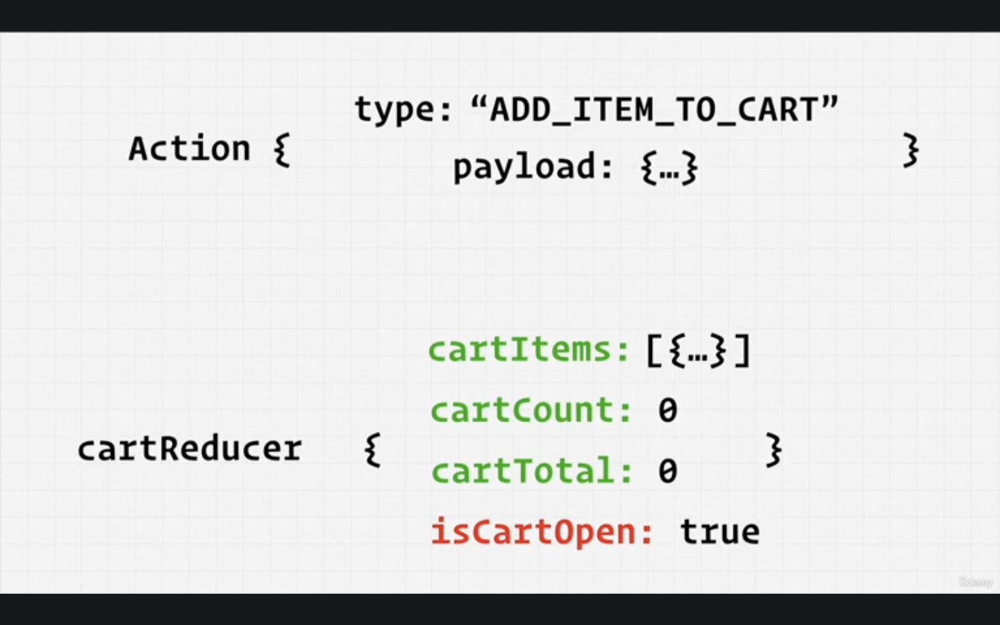

Example with reducers and context:

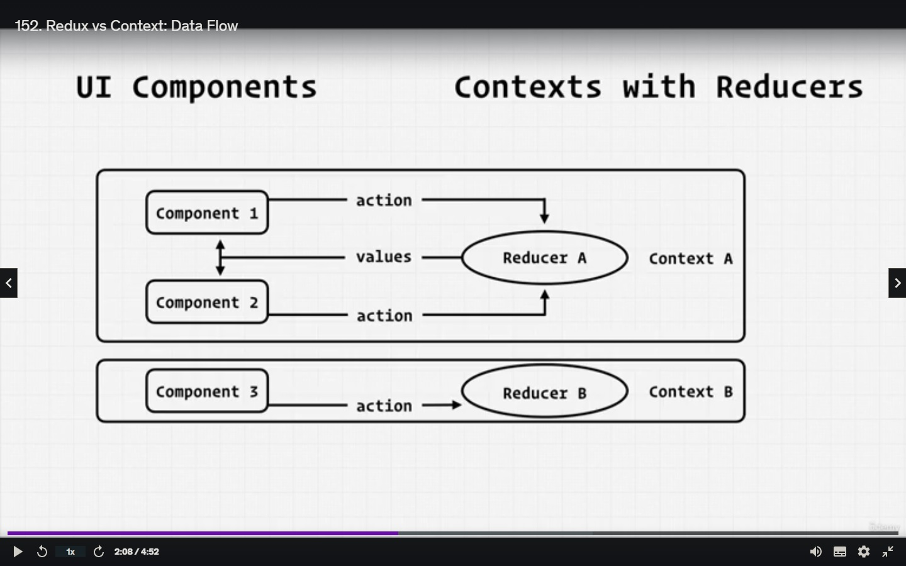

Example with redux data flow:

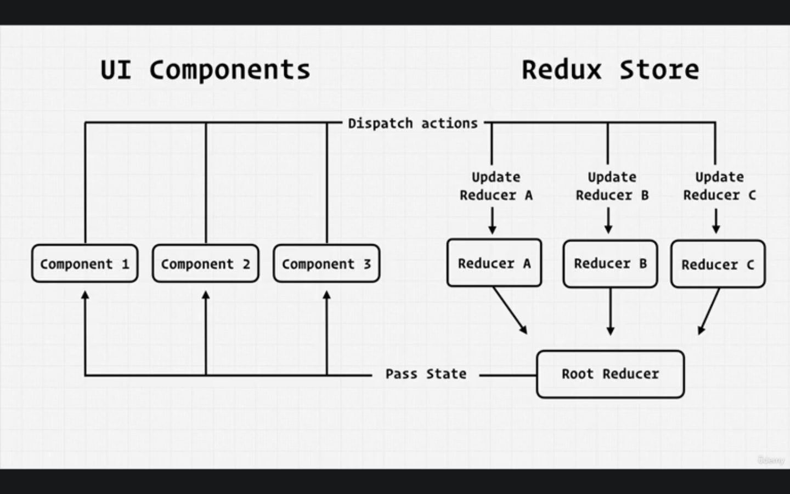 


Actions:

Action in Redux terminology refers to a plain JavaScript object, sometimes accompanied by helper methods, that describes an intention to change the application's state.

```

export const clearItemFromCart = (cartItems, cartItemToRemove) =>
{
        const newCartItems = clearCartItem(cartItems,cartItemToRemove);
        return createAction(CART_ACTION_TYPES.SET_CART_ITEMS, newCartItems);
}

```

To Consume an action from a component you will always need to dispatch it and with this setup we 
need to supply the current cartItems array so you would also need to supply the current list of cartItems

```
    // useDispatch from 'react-redux'
    const dispatch = useDispatch();
    // useSelector from 'react-redux'
    const cartItems = useSelector(selectCartItems);
    
    const clearItemHandler = () => { 
      dispatch(clearItemFromCart(cartItems,cartItem));
    }

```

Reducers:

In Redux, a reducer is a pure function responsible for handling actions and producing the next state of an application. It takes in the current state and an action as input and returns the new state. Reducers are designed to be predictable and should not mutate the state directly. Instead, they create a new state object based on the current state and the action received. The reducer is a crucial component in Redux as it determines how the state should be updated in response to different actions.

```

import { CATEGORIES_ACTION_TYPES } from "./category.types";

export const CATEGORIES_INITIAL_STATE = {
    categories: [],
}

export const categoriesReducer = (state = CATEGORIES_INITIAL_STATE, action = {}) =>
{
    const { type, payload } = action;

    switch(type) {
        case CATEGORIES_ACTION_TYPES.SET_CATEGORIES:
            return { ...state, categories: payload }
        default:
            return state;
    }
}

```

Selectors:

Selectors in Redux are functions that retrieve and compute derived data from the application state. They help decouple the components from the structure of the state, promoting reusability and allowing efficient memoization for performance optimization using libraries like Reselect.

Types:

In Redux, types refer to action type constants, typically defined as string values, used to identify and differentiate different actions in the application. They are used to handle actions in reducers and ensure consistency throughout the codebase.

When creating your reducer:

```

// the root reducer runs through all the reducer actions 
// hence why at the end of each reducer we should by default 
// return the original state
export const userReducer = (state = USER_INITIAL_STATE, action = {}) => {
    const {type, payload} = action;

    switch (type)
    {
        case USER_ACTION_TYPES.SET_CURRENT_USER:
        return { ...state,currentUser: payload };
        default:
            return state;

    }
}


```

###### Redux Reselect


Reselect is a library for memoized selectors in Redux. It efficiently computes derived data from the Redux store, optimizing performance by avoiding unnecessary recalculations when the input state remains unchanged.


```

import { createSelector } from 'reselect';

const selectCategoryReducer = (state) => state.categories;

export const selectCategories = createSelector(
    [selectCategoryReducer],
    (categoriesSlice) => categoriesSlice.categories
  );

  export const selectCategoriesMap = createSelector(
    [selectCategories],
    (categories) => {
       return categories.reduce((acc, category) => {
            const { title, items} = category;
            acc[title.toLowerCase()] = items;
            return acc;
        },{})
    }
);


```

###### Redux Persist

Redux Persist is a library for persisting the Redux store data across browser refreshes or app restarts. It enables seamless state persistence by automatically storing and rehydrating the state from storage mechanisms like local storage or AsyncStorage.

```

npm install redux-persist

```


The import statement storage from 'redux-persist/lib/storage' is used to import the storage mechanism provided by the Redux Persist library. It provides an abstraction for storage operations, allowing data to be saved and retrieved from the chosen storage engine (e.g., localStorage, AsyncStorage).


In the example below we are casting the storage to use localstorage of the browser by default as the keyname.

```

const persistConfig = {
    key: 'root',
    storage,
    blacklist:['user']
}


```

The blacklist is which named key of the assoiciated reducer should not be stored 
we wont store the user as we are already hooking into firebase onAuth changed hook 
and dont want any unwated conflicting persist issues

###### REDUX THUNK

Redux Thunk is a middleware for Redux that allows writing action creators that return functions instead of plain action objects. These functions can dispatch multiple actions asynchronously, perform side effects like API calls, and delay dispatching actions until certain conditions are met, enhancing the flexibility of Redux workflows.


Example of action been able to dispatch another synchronous action within

```

dispatch(fetchCategoriesStart());

```

Full function here:

``` 

export const fetchCategoriesStartAsync = () => {
  return async (dispatch) => {
    dispatch(fetchCategoriesStart());
    try {
      const categoriesArray = await getCategoriesAndDocumentsForReduxSelector('categories');
      dispatch(fetchCategoriesSuccess(categoriesArray));
    } catch (error) {
      dispatch(fetchCategoriesFailure(error));
    }
  };
};


```


###### REDUX SAGA

Redux Saga is a middleware library for managing side effects in Redux applications. It provides an elegant way to handle asynchronous actions, such as API calls, by using generator functions to create complex and asynchronous workflows, allowing for better control and coordination of application state.


SAGA works much the same as generator functions

Generator function:

A generator function in JavaScript is a special type of function that can be paused and resumed during execution, allowing for the generation of a sequence of values over time. It provides a powerful mechanism for writing code that produces values on demand, making it useful for handling asynchronous operations and iterating over large data sets.


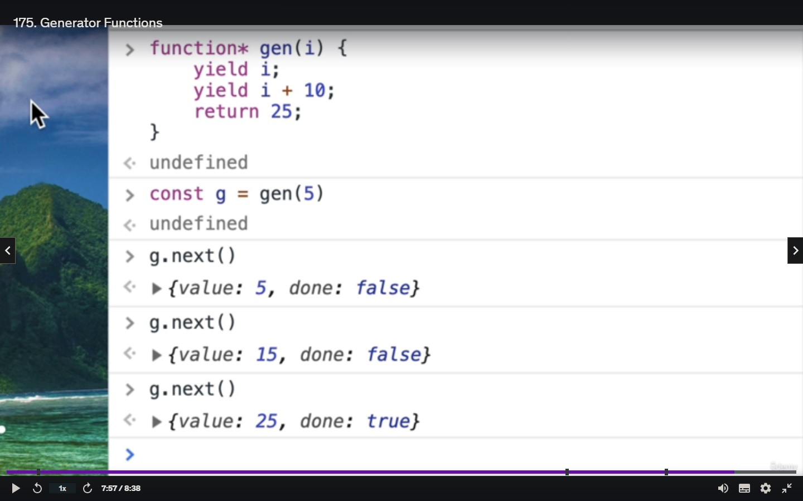


#### The Main functions of a saga is the following:


##### CALL 

This effect invokes a function asynchronously and waits for it to complete before proceeding to the next step in the generator.

```
/*
 * @param fn A Generator function, or normal function which either returns a
 *   Promise as result, or any other value.
 * @param args An array of values to be passed as arguments to `fn`
*/
const categoriesArray = yield call(getCategoriesAndDocumentsForReduxSelector, 'categories');

```

##### PUT:

This effect dispatches an action to the Redux store, allowing state changes in response to certain events or triggers.

```

/**
 * Creates an Effect description that instructs the middleware to dispatch an
 * action to the Store. This effect is non-blocking, any errors that are
 * thrown downstream (e.g. in a reducer) will bubble back into the saga.
 *
 * @param action [see Redux `dispatch` documentation for complete info](https://redux.js.org/api/store#dispatchaction)
 */

 yield put(fetchCategoriesSuccess(categoriesArray));

/*
    The yield keyword is used in JavaScript generators and async functions to pause the execution of a function and return a value. It allows the function to be resumed later, and each time the function is resumed, it continues from where it left off, maintaining its internal state.
*/


```

##### all:

This effect allows multiple sagas to be run concurrently, enabling parallel execution of sagas.

```

/**
 * Creates an Effect description that instructs the middleware to run multiple
 * Effects in parallel and wait for all of them to complete. It's quite the
 * corresponding API to standard
 * [`Promise#all`](https://developer.mozilla.org/en/docs/Web/JavaScript/Reference/Global_Objects/Promise/all).
 *
 * #### Example
 *
 * The following example runs two blocking calls in parallel:
 *
 *    import { fetchCustomers, fetchProducts } from './path/to/api'
 *    import { all, call } from `redux-saga/effects`
 *
 *    function* mySaga() {
 *      const [customers, products] = yield all([
 *        call(fetchCustomers),
 *        call(fetchProducts)
 *      ])
 *    }
 */
yield all([call(onFetchCategories)]);


``` 

##### Takelatest

This effect listens for a specified action and, if multiple instances of the action occur, only the latest one is processed while canceling previous ones.


```

/**
 * Spawns a `saga` on each action dispatched to the Store that matches
 * `pattern`. And automatically cancels any previous `saga` task started
 * previously if it's still running.
 *
 * Each time an action is dispatched to the store. And if this action matches
 * `pattern`, `takeLatest` starts a new `saga` task in the background. If a
 * `saga` task was started previously (on the last action dispatched before the
 * actual action), and if this task is still running, the task will be
 * cancelled.
 *
 * #### Example
 *
 * In the following example, we create a basic task `fetchUser`. We use
 * `takeLatest` to start a new `fetchUser` task on each dispatched
 * `USER_REQUESTED` action. Since `takeLatest` cancels any pending task started
 * previously, we ensure that if a user triggers multiple consecutive
 * `USER_REQUESTED` actions rapidly, we'll only conclude with the latest action
 *
 *    import { takeLatest } from `redux-saga/effects`
 *
 *    function* fetchUser(action) {
 *      ...
 *    }
 *
 *    function* watchLastFetchUser() {
 *      yield takeLatest('USER_REQUESTED', fetchUser)
 *    }
 *
 * #### Notes
 *
 * `takeLatest` is a high-level API built using `take` and `fork`. Here is how
 * the helper could be implemented using the low-level Effects
 *
 *    const takeLatest = (patternOrChannel, saga, ...args) => fork(function*() {
 *      let lastTask
 *      while (true) {
 *        const action = yield take(patternOrChannel)
 *        if (lastTask) {
 *          yield cancel(lastTask) // cancel is no-op if the task has already terminated
 *        }
 *        lastTask = yield fork(saga, ...args.concat(action))
 *      }
 *    })
 *
 * @param pattern for more information see docs for [`take(pattern)`](#takepattern)
 * @param saga a Generator function
 * @param args arguments to be passed to the started task. `takeLatest` will add
 *   the incoming action to the argument list (i.e. the action will be the last
 *   argument provided to `saga`)
 */
yield takeLatest(
        CATEGORIES_ACTION_TYPES.FETCH_CATEGORIES_START,
        fetchCategoriesAsync
    );

// Takes the action as the first paramter and cancels any prior actions running or just started and starts a new action with new saga

```


Here is an example of dispatching another action within an Saga:


```

export function* Sign_Up({ payload: {email,password,displayName}})
{
  try
  {
    const { user } = yield call(createAuthUserWithEmailAndPassword,email,password);
    // dispatch signUpSuccess once user has been created and add the display
    // name as additonal information
    yield put(signupSuccess(user,{displayName}));
  }
  catch(error)
  {
    yield put(signOutFailed(error))
  } 
}

```


#### Redux Toolkit

Redux Toolkit is a library that simplifies the process of managing state in React applications using Redux. It provides a set of opinionated tools and utilities, including a concise API, to reduce boilerplate code and improve developer productivity. With Redux Toolkit, you can easily define actions, reducers, and store configurations, allowing for efficient state management. It also integrates seamlessly with React components, enabling efficient updates and re-rendering. Overall, Redux Toolkit streamlines the Redux workflow and enhances the development experience for React applications.

By default Redux toolkit comes with Redux Thunk added.

```
// When the middleware is explicity set the other default included middleware is 
// NOT included
export const store = configureStore(reducer: rootReducer,middleware:middleware)


/// With CreateSlice it creates the Action 


export const userSlice = createSlice({
  name: 'user',
  initialState: INITIAL_STATE,
  reducers: {
    // setCurrentUser is now an action within toolkit
    setCurrentUser(state, action) {
        // state still gets mutated and is still immutable under the hood
        // redux toolkit creates a new state by using a library emmer
      state.currentUser = action.payload;
    },
  },
});

```

Elimitating two files of extra boilerplate code Actions and Types

Now we are able to pull off the userSlice Action from the object

```

export const { setCurrentUser } = userSlice.actions

export const userReducer = userSlice.reducer

```


##### Thunk: 

A middleware that enables writing action creators that return functions instead of plain objects, allowing for asynchronous logic and side effects in Redux applications.

##### Immutable State Invariant: 

A middleware that checks if any state mutations occur outside of reducers, helping to maintain the immutability principle in Redux and catch accidental modifications.

##### Serializability Checker: 

A middleware that verifies if the Redux state is serializable, ensuring that the state can be serialized and deserialized correctly, which is crucial for features like time-travel debugging and server-side rendering.


The non-serializable middleware in Redux Toolkit is designed to catch potential issues related to using certain types of data in actions. By default, it prevents the inclusion of non-serializable values in Redux actions. Non-serializable values are those that cannot be easily converted to a plain JavaScript object, typically because they have internal state or behavior that cannot be replicated.

Some examples of non-allowed types are functions, Promises, Dates, and non-plain JavaScript objects. Functions and Promises represent behavior or asynchronous operations that should not be stored in the Redux store. Dates and non-plain JavaScript objects may have internal state that can lead to unexpected behavior when serializing and deserializing the state.

The non-serializable middleware helps enforce best practices by encouraging the use of plain data structures in Redux actions, ensuring predictable and serializable state updates.

Ways to get around this issue is by turning off the default middleware

```

export const store = configureStore({
  reducer: rootReducer,
  middleware: (getDefaultMiddleware) =>
    getDefaultMiddleware({
        serializableCheck: false,
    }).concat(middleWares),
});

```


##### Stripe


```

// install
npm install stripe/stripe-js stripe/react-stripe-js

```

This includes some already built components from stripe to integrate into your web app


create-react-app by default allows us to use the .env file for enviroment variables all variables must start with REACT_APP...


#### Netlify Server Functions

in order to setup the server functions you need to add a folder to the root of your project like below:

Netlify functions run on AWS Lambda with a node js enviroment and they allow a limited 10 second runtime

When you want to add modules to use in the netlify function you must install them to the same root 
package json as the project


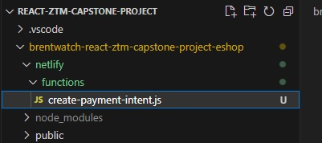

It will always look for a folder named functions under the netlify

Whatever the name of the file is the name of the route for the HTTP Endpoint.

create-payment-intent.js

When working with netlify functions its a new node enviroment so when you wanna invoke the .env file you will need to install the dotenv node package becuase we are not in create react app land.

##### Netlifiy CLI

This will help hook up the server function for the stripe function.

install the netlify onto the global instance of the local pc.

It will allow you to update variables and a range of other things on netlify without going via the web portal.

```

npm install -g netlify-cli

```

by typing netlify into the terminal you will see all the Commands available

 $ addons       (Beta) Manage Netlify Add-ons
  $ api          Run any Netlify API method
  $ build        (Beta) Build on your local machine
  $ completion   (Beta) Generate shell completion script
  $ deploy       Create a new deploy from the contents of a folder
  $ dev          Local dev server
  $ env          Control environment variables for the current site
  $ functions    Manage netlify functions
  $ recipes      (Beta) Create and modify files in a project using pre-defined recipes
  $ init         Configure continuous deployment for a new or existing site. To create a new site without continuous deployment, use `netlify sites:create`
  $ link         Link a local repo or project folder to an existing site on Netlify
  $ lm           Handle Netlify Large Media operations
  $ login        Login to your Netlify account
  $ open         Open settings for the site linked to the current folder
  $ serve        (Beta) Build the site for production and serve locally. This does not watch the code for changes, so if you need to rebuild your site then you must exit and run `serve` again.
  $ sites        Handle various site operations
  $ status       Print status information
  $ switch       Switch your active Netlify account
  $ unlink       Unlink a local folder from a Netlify site
  $ watch        Watch for site deploy to finish

  to use any of these commands you would need to login by running netlify login it will login via interface

  To run a local dev enviroment hit netlify dev 

  This will use the same build enviroment as the netlifiy build on netlify servers as your pc.
  it will also integrate your server functions into the build allowing you to test your server functions locally.


# NB STRIPE ACCEPTS PAYMENTS IN CENTS


```

exports.handler = async (event) => {
    try{
        // With Stripe it takes Cents as a whole number
        const { amount } = JSON.parse(event.body);
        const paymentIntent = await stripe.paymentIntents.create({
            amount,
            currency: "usd",
            payment_method_types: ["card"]
        });
        return { statusCode: 200,
        body: JSON.stringify({ paymentIntent}) 
        }
    }catch(error)
    {
        console.log({ error });

        return {
            status: 400,
            body: JSON.stringify({error})
        }
    }
}

```

In AWS Lambda, the handler function is the entry point for your serverless function. It is the function that gets executed when the Lambda function is triggered. The exports.handler syntax is used to export the function as the handler for the Lambda function.

Here's a breakdown of the components in the line:

exports: It is an object provided by the CommonJS module system in Node.js that allows you to export functions, objects, or variables from a module.
handler: It is the name of the exported function that will serve as the entry point for the Lambda function. You can choose any name you prefer.
async (event) => { ... }: This is an arrow function that is defined as async. It takes an event parameter, which represents the input data passed to the Lambda function.
async: The async keyword indicates that the function is an asynchronous function. It enables the use of await to handle asynchronous operations within the function.
(event) => { ... }: It is the function body, where you write the logic for processing the input event and generating the desired output.
Inside the function body, you can write the code to handle the event, perform any necessary computations or operations, and return a response. The async keyword allows you to use await to handle promises and make asynchronous code look more synchronous.

Keep in mind that this code snippet is specific to defining a handler for an AWS Lambda function. The actual implementation and behavior of the function depend on the specific requirements of your application and the AWS Lambda event structure you are working with.


## STRIPE Test Cards

[Stripe Test Cards](https://stripe.com/docs/testing#cards)

[Stripe React UI Elements](https://stripe.com/docs/stripe-js/react#available-element-components)


# Stripe Issue

Modules not found issue

When installing the module it sets it up like this in your package.json

```

"@stripe/react-stripe-js": "github:stripe/react-stripe-js",
"@stripe/stripe-js": "github:stripe/stripe-js",

```

It should instead read:

```

 "@stripe/react-stripe-js": "^2.1.1",
 "@stripe/stripe-js": "^1.54.1",

```

With the version numbers not the github repos.

It should be installed like below to prevent this issue:

```

npm install @stripe/react-stripe-js@1.1.2

npm install @@stripe/stripe-js@1.11.0

```

Here is the npm links to the live packages online to make sure you always use the latest

[@stripe/react-stripe-js](https://www.npmjs.com/package/@stripe/react-stripe-js)

[@stripe/stripe-js](https://www.npmjs.com/package/@stripe/stripe-js)


[Stripe Payment Method Types](https://stripe.com/docs/api/payment_intents/object?lang=node#payment_intent_object-payment_method_types)


# TypeScript

TypeScript is a strongly typed superset of JavaScript that offers several advantages. Firstly, it provides static typing, enabling early error detection and better code quality. With TypeScript, developers can catch common errors during development and benefit from autocompletion and code navigation tools. Additionally, TypeScript supports modern JavaScript features, making it compatible with existing JavaScript codebases. It enhances code scalability and maintainability by supporting object-oriented programming concepts such as classes, interfaces, and modules. TypeScript also aids in documentation generation and improves collaboration in large teams. Its transpilation process ensures cross-browser compatibility, and its growing community provides extensive tooling and library support.


Main Advantage:

 Javascript is dynamically typed so only at runtime will it run into errors when it tries and calls methods on on objects that methods dont exist like trying to call toLowerCase() on an array will only caus error at runtime with TypeScript it will happen at code time.

We should never use the any keyword as this defeats the purpose of typescript instead the variable should be typed.

n TypeScript, however, there is a difference. The lowercase string represents the primitive type for string values, whereas the uppercase String refers to the String object type. The string primitive type is the recommended one to use in TypeScript for string values.


Installing TypeScript:

When working with react 17

use npm install typescript@4


```

npm install typescript @types/node @types/react @types/react-dom @types/jest

```


After Installing You will need to add a TS Config otherwise without it if you convert a jsx or js file 
you will recieve the following error:


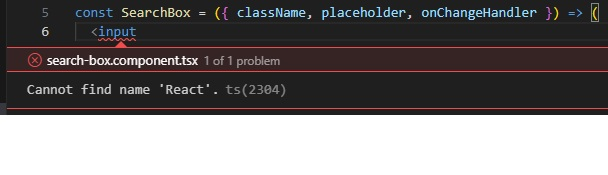


TS Config

tsconfig refers to the tsconfig.json file, which is a configuration file used in TypeScript projects. It specifies various compiler options and settings for the TypeScript compiler (tsc). The tsconfig.json file defines project-specific compilation settings, module resolution, file inclusion/exclusion patterns, target ECMAScript version, and more. It allows developers to customize the TypeScript compilation process for their projects.


#### Interface Overloading 

Object overloading in TypeScript refers to the ability to define multiple function signatures for an object's method or function, allowing different combinations of parameters and return types to be used. This enables the flexibility to handle varying input types and produce different output types based on the provided arguments.

Here's an example of object overloading in TypeScript:

```
interface MathOperation {
  add(x: number, y: number): number;
  add(x: string, y: string): string;
}

const math: MathOperation = {
  add: (x: number | string, y: number | string): number | string => {
    if (typeof x === 'number' && typeof y === 'number') {
      return x + y; // Addition of numbers
    }
    if (typeof x === 'string' && typeof y === 'string') {
      return x.concat(y); // Concatenation of strings
    }
    throw new Error('Invalid arguments');
  }
};

console.log(math.add(5, 10)); // Output: 15
console.log(math.add("Hello", " TypeScript!"));

```

Making Interfaces Extensisble Typescript under the hood combines the interfaces and allows you to overload your Interface

Types dont have the ability to overload and combine

having an optional paramter can be defined:

```
// ? allows the property to be optional
interface ITest
{
    Itest?:string
}

```


##### Union Types

Union types in TypeScript allow variables to hold values of multiple types, providing flexibility and code reuse. They enable conditional logic and dynamic type variations, allowing for fine-grained control and streamlined development. They enhance the expressiveness and versatility of TypeScript for handling diverse data types and scenarios.


```

type USAddress = {
    street: string;
    state: string
}

type CanadianAddress = {
    street: string,
    province: string
}

// Union Type
type Address = USAddress | CanadianAddress;

// You can define the object with either of the object and property markup as the types included in the union type
const Address:Address = {
   street = 'street',
   state = 'state' 
}

```


Converting jsx to tsx functional component:


###### JSX Functional Component

```

import './search-box.styles.css';

const SearchBox = ({ className, placeholder, onChangeHandler }) => (
  <input
    className={`search-box ${className}`}
    type='search'
    placeholder={placeholder}
    onChange={onChangeHandler}
  />
);

export default SearchBox;

```


##### TSX Functional Component

```

import { ChangeEvent } from 'react';

import 'search-box.styles.css';

type SearchBoxProps = {
  className: string;
  placeholder?: string;
  onChangeHandler: (event: ChangeEvent<HTMLInputElement>) => void;
};

const SearchBox = ({
  className,
  placeholder,
  onChangeHandler,
}: SearchBoxProps) => (
  <input
    className={`search-box ${className}`}
    type='search'
    placeholder={placeholder}
    onChange={onChangeHandler}
  />
);

export default SearchBox;

```


The onChangeHandler is a function signature or type definition in TypeScript. Let's break it down:

(event: ChangeEvent<HTMLInputElement>): This part specifies the function parameter event and its type. It indicates that the parameter is an event object of type ChangeEvent which is specifically tailored for HTML input elements (<input>). The ChangeEvent type is typically provided by libraries like React or by the TypeScript DOM typings.

=> void: This part denotes the return type of the function. In this case, void indicates that the function does not return any value.

Combining all the parts together, the onChangeHandler function is expected to receive an event of type ChangeEvent<HTMLInputElement> (representing an input change event) and does not return anything (void). Typically, this kind of function is used as an event handler for the onChange event of an HTML input element, allowing you to perform specific actions or logic when the input value changes.


```

    onChangeHandler: (event: ChangeEvent<HTMLInputElement>) => void;

```

##### Thirdparty APIs

When working with thirdparty APIs we want to type our API call function.

In order to safegaurd our app from any changes made to the third party API that it returns.

We wanna create a generic function to prevent these errors

```

export const getData = async <T>(url:string): Promise<T> => {
  const response = await fetch(url);
  return await response.json();  
}


```

Typing Use State:

```

const [monsters, setMonsters] = useState<Monster[]>([]);

```

Consuming the generic api call:

```
 const users = await getData<Monster[]>(
        'https://jsonplaceholder.typicode.com/users'
      );
      setMonsters(users);

```


##### Generics

Generics in TypeScript enable the creation of reusable components and functions that can work with different types. They allow for the parameterization of types, enabling flexibility, type safety, and the ability to create generic classes, interfaces, and functions that adapt to various data types.

We want the return type to be an Promise<T> generic T typed paramater.

It normally starts with T then S then R etc for generics...


##### TypeScript Inferance

TypeScript inference is the process by which the TypeScript compiler automatically determines the type of a variable or expression based on its usage and context. It analyzes the code and infers the most appropriate type, reducing the need for explicit type annotations and enabling more concise and readable code.

##### Create React App Tip


If a file extension is js it will attempt to see if the file is returning jsx to convert it to jsx however I am not sure if this will work with vite build server.


##### Typing Out Redux

if you want to overload functions in Typescript they must have the same amount of paramaters.

```


```

This is an example of a discrimnary union type
// action = {} as CategoryAction

This allows the reducer to respond to the Category Action union type


##### Type guards 

Type guards in TypeScript are conditional checks or functions that narrow down the type of a value at compile-time, enabling safer access to properties and methods specific to that narrowed type.


The reason we need to implement the typeGaurds is becuase this reducer 


```

export const categoriesReducer = (state = CATEGORIES_INITIAL_STATE,
     action = {} as CategoryAction) =>
{
    // At this point the action type is Action however
    // if leave the destructring once it hits its desired 
    // function below it will be of type with or without action type
    //const { type, payload } = action;

    switch(action.type) {
        case CATEGORIES_ACTION_TYPES.FETCH_CATEGORIES_START:
            return { ...state, isLoading: true }
        case CATEGORIES_ACTION_TYPES.FETCH_CATEGORIES_SUCCESS:
            return { ...state,isLoading:false, categories: action.payload }
        case CATEGORIES_ACTION_TYPES.FETCH_CATEGORIES_FAILED:
            return { ...state, isLoading: false, error: action.payload}
        default:
            return state;
    }
}


```

Assumes that the only type action coming through is a CategoryAction but this is not true with REDUX all reducers get dispatched
so therefore we need to implement some kind of typeguard when introducing other reducers


Intersection Types:

Intersection types in TypeScript allow you to combine multiple types into a single type, creating a new type that includes all the properties and methods from each constituent type. An intersection type is denoted by using the & operator between the types

And it can be used with interfaces and types

```

interface A {
  propA: string;
}

interface B {
  propB: number;
}

type AB = A & B;

const obj: AB = {
  propA: "Hello",
  propB: 42,
};

```

Casting example: using the as keyword

```

return querySnapshot.docs.map((docSnapshot) => docSnapshot.data() as Category);

```


Typing out async functions with promise return types

```

 getCurrentUser = (): Promise<User | null> =>

```

Return Type:

Returns the return type of a function in TypeScript.

###### Readonly in TypeScript

In TypeScript, the readonly modifier is used to indicate that a property or an array element cannot be modified once it is assigned a value. This modifier can be applied to properties in interfaces, classes, or array types. Making it Immmutable.

```

export type CartState = {
  readonly isCartOpen:boolean;
  readonly cartItems: CartItem[],
};

```

Typescript will prevent any direct assignment to each property

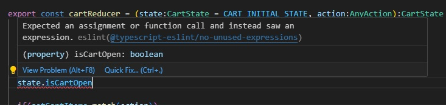


Some third party Libraries Modules etc will, have a separate types library basicly a typed version of the npm that you would need to install.

In future when importing components rather import like this to prevent any issues when you miggrate from js to ts files

```
import { selectCurrentUser } from '../../store/user/user.selector';

```


##### Typing the Redux Sagas

```

npm install typed-redux-saga

```

We also need to include a macro for Babel

npm install babel --dev babel-plugin-macros

If you see such an error when migrating your sagas over to TS

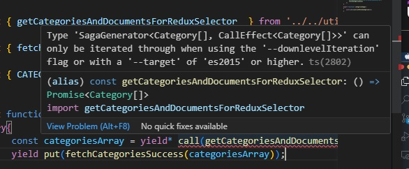

This issue is not todo specifically with sagas itself but more with generator functions because with generator functions the return type is never always going to return the same type and their could be many yields in one generator function.

If you facing this issue try adding the:

"downlevelIteration": false,

to your tsconfig file and if the error does not disappear try restarting


##### Styled Components Types


```

npm install @types/styled-components

```

When working with styled components and using the typing you might encounter the follwing 
issue:

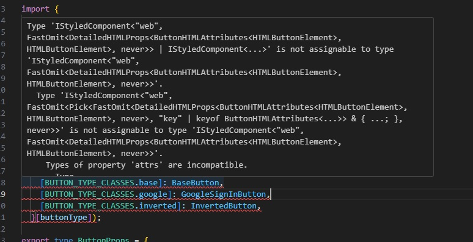

rather use a the styled-components version 5.3.3

This issue needs to be further investigated I am not sure if its due to us using react 17 and trying to use the latest styled components need to invetigate further.


Typing out form input elements:

```

type FormInputProps = { label: string } & InputHTMLAttributes<HTMLInputElement>;


const FormInput:FC<FormInputProps> = ({ label, ...otherProps}) => 

```

When typing out component return types you can use the following strategy for its children input and the input props:

```

 export type ButtonProps = {
    buttonType?: BUTTON_TYPE_CLASSES;
    isLoading?: boolean;
  } & ButtonHTMLAttributes<HTMLButtonElement>;
  
  const Button: FC<ButtonProps> = ({
    children,
    buttonType,
    isLoading,
    ...otherProps
  }) => 

```


and for styled component props:

```
type FormInputLabelProps = {
  shrink?:boolean;
}


export const FormInputLabel = styled.label<FormInputLabelProps>`
      color: ${subColor};
      font-size: 16px;
      font-weight: normal;
      position: absolute;
      pointer-events: none;
      left: 5px;
      top: 10px;
      transition: 300ms ease all;
      ${({ shrink }) => shrink && shrinkLabelStyles};
`

```

When typing out a component when using a svg and you encounter this error:

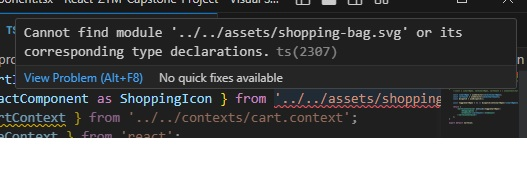


Step 1:

Create a custom.d.ts file:


```

declare module '*.svg' {
  import React = require('react');
  export const ReactComponent: React.FC<React.SVGProps<SVGSVGElement>>;
  const src: string;
  export default src;
}

```

add it to the ts config and the error should disappear 

When you use an external library in TypeScript, you typically import the library using an import statement. However, if the library doesn't have TypeScript declarations (.d.ts files) or if you want to add additional type information for the library, you can use the declare module statement to define the types yourself.


When working with typed properties for Functional Components you want to type it out in the following way


```

const CartItem:FC<CartItemProps> = ({cartItem}) => {
    const { name , quantity,imageUrl,price } = cartItem;}

```

In the code you provided, you are declaring a functional component named CartItem with the type annotation FC<CartItemProps>. The component receives the cartItem prop, and inside the component, you are using object destructuring to extract the name, quantity, imageUrl, and price properties from the cartItem object.


When working with a component that can accept other properties you can use the following method:

by using intersection types.

```

type FormInputProps = { label: string } & InputHTMLAttributes<HTMLInputElement>;


const FormInput:FC<FormInputProps> = ({ label, ...otherProps})

```

If you wanna type the type the change event on a component you can do the following

```

const handleChange = (event:ChangeEvent<HTMLInputElement>) => 

```

and you are able to select what type of element the change occured on


```

const { category } = useParams<keyof CategoryRouteParams>() as CategoryRouteParams;

```

useParams is a hook provided by React Router that allows you to access the parameters from the current URL.
keyof CategoryRouteParams is a TypeScript construct that represents the union of all keys (property names) in the CategoryRouteParams type. It essentially provides the list of possible parameter keys.
as CategoryRouteParams is a type assertion in TypeScript, which tells the compiler to treat the result of useParams as an object of type CategoryRouteParams.
Assuming you have defined the CategoryRouteParams type somewhere in your code, this line of code retrieves the URL parameters using useParams and ensures that the returned object adheres to the CategoryRouteParams type.

##### Javasript tip

Object.assign is a built-in function in JavaScript that is often used to copy or merge properties from multiple source objects into a target object. It allows you to create a new object by combining the properties of one or more source objects.

Here's an example of using Object.assign:

javascript
Copy code
const target = { a: 1 };
const source = { b: 2, c: 3 };

const merged = Object.assign(target, source);

console.log(merged);
// Output: { a: 1, b: 2, c: 3 }

##### Performance Optimization


```

const submitHandler = () => {
  ...

}

```


Each time react rerenders it reinitialieses this code so in order to prevent that we can use the 
useCallback hook from react to prevent any reinits occuring:

##### UseCallback


```
const increment = useCallback(() => {
    setCount(prevCount => prevCount + 1);
  }, [variableTowatch]);

```

The above method works much the same as a useEffect no changes on the function attributes then it will remain the same. However if there is a change in the var it will reninit.

Dont define large convulated functions.

When adding the item in the dependancy array you basicly saying you expect a change to the callback.


##### UseMemo

useMemo is useful when you have a costly computation or a heavy calculation that you want to perform only when necessary.

much the same as useCallback but useMemo memorises the return value and can also be used:

```

 const sum = useMemo(() => {
    console.log('Calculating sum...');
    return a + b;
  }, [a, b]);

```

##### Performance Optimisation

In order to prevent any unneccessary rerenders you can investigate by using the React Dev Tools Profiler

Install the React Dev Tools for chrome 

and open the developer tools and goto the profiler tab click the round button and execute your user journey 

User journey:

Open Cart:

Add three brown hats 
Add five red beanies 
Add 1 Blue hat

Once completed with your user journey click the round button to end the recording.

You will be able to navigate your way through the flame graph. The grey areas indicate the components which did not render and the blue and yellow are the areas that did.


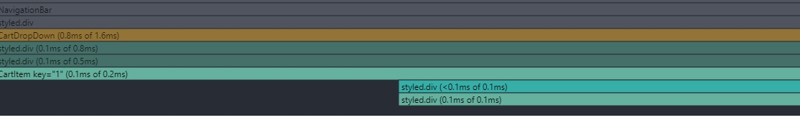


and on the right hand side you will see the name of the component and a timeline which shows timestamps for each time the item is rendered in this case its 9 times for the cart item as that is the number of cart items that was added but it should not be rendering each item over and over when some items are have not changed at all.

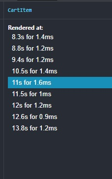


Now in order to solve the rerendering issue we can use the memo function from react:

```
import {react, memo} from 'react'

const CartItem:FC<CartItemProps> = memo(({cartItem}) => {
    const { name , quantity,imageUrl,price } = cartItem;
    return (
        <CartItemContainer>
            
            <ItemDetails>
                <span className="name">{name}</span>
                <span className="price">
                    {quantity} x ${price}
                </span>
            </ItemDetails>
        </CartItemContainer>
    );
})

```

In the image below you will notice now with the change to the code it only renders three times it is each time a new quantity of the same cart item is added:

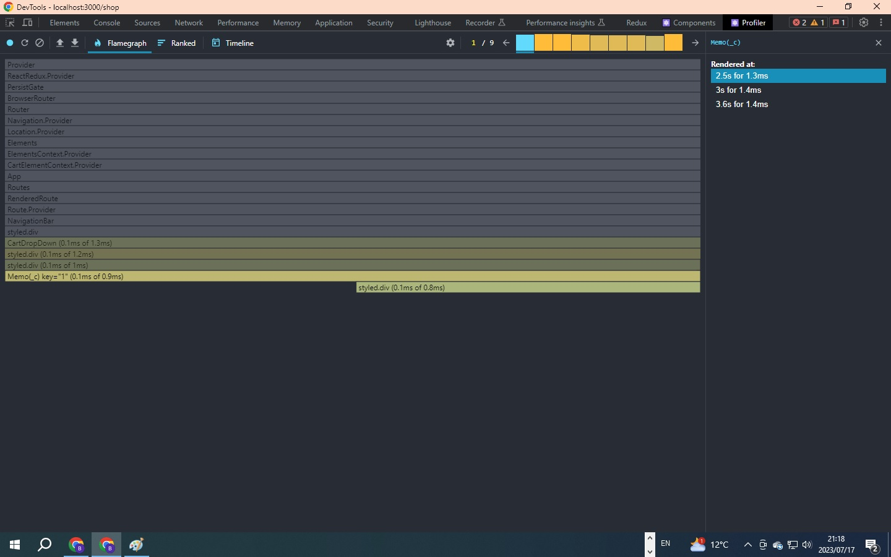


Breaking a component into smaller pieces is a common technique in React to optimize performance and prevent unnecessary re-rendering of large portions of the UI.

When a component's state or props change, React will re-render that component and all of its child components. If a component has a large tree of child components, a change in state or props at the top level can trigger re-rendering of the entire subtree, even if only a small portion of it actually needs to be updated.


Now if you look at the item rendered at 4 which is a new item you will notice its greyed out meaning its not been rerendered.

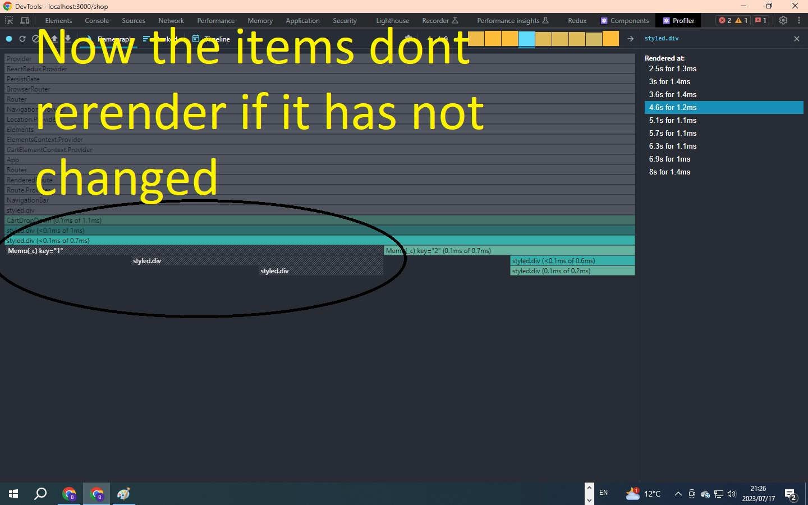


###### Code Splitting lazy and Suspense


In order to improve load time and provide global spinner do the following:


```

import { Routes,Route } from "react-router-dom";


import { useDispatch } from "react-redux";
import { useEffect,Suspense,lazy } from "react";
import { checkUserSession } from "./store/user/user.action";
import Spinner from "./components/spinner/spinner.component";

const  Home = lazy(() => import("./routes/home/home.component"));
const NavigationBar = lazy(() => import("./routes/navigation-bar/navigation-bar.component"));
const Authentication = lazy(() => import("./routes/authentication/authentication.component"));
const Shop = lazy(() => import("./routes/shop/shop.component"));
const Checkout = lazy(() => import("./routes/checkout/checkout.component"));

const App = () => { 
  const dispatch = useDispatch();
  useEffect(()=> {
      dispatch(checkUserSession());
  },[])

  return (
    <Suspense fallback={<Spinner/>}>
    <Routes>
      <Route path="/" element={<NavigationBar/>}>
        <Route index element={<Home/>}/>
        <Route path="shop/*" element={<Shop/>}/>
        <Route path="auth" element={<Authentication/>}/>
        <Route path="checkout" element={<Checkout/>}/>
      </Route>
    </Routes>
    </Suspense>
  );
};

export default App;


```


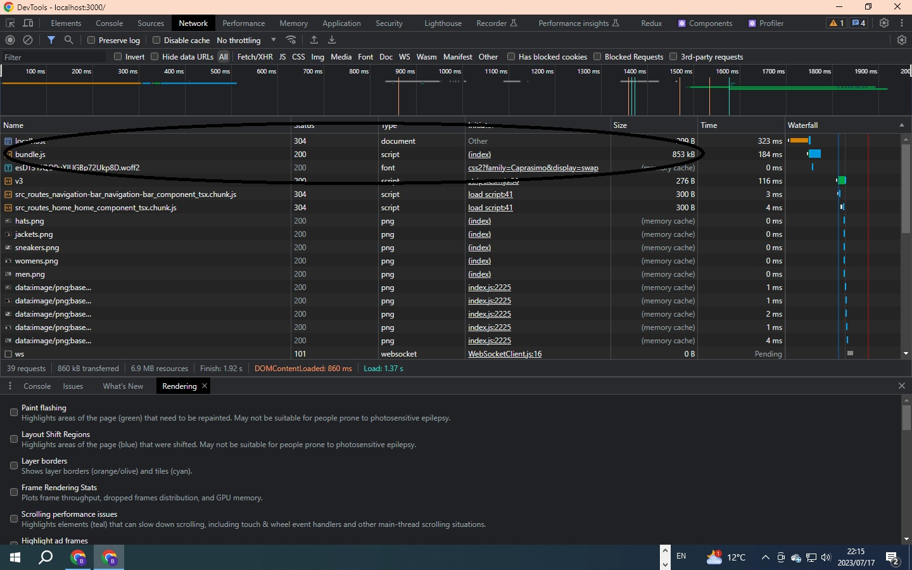


###### Firebase Rule Security

Each Database in firebase firestore has a set of rules associated with it and you can get to it:

1. Click Firebase Firestore in your project console dashboard links
2. Click on the rules tab

on the left side you will see the history of the changes made to the rules see below:

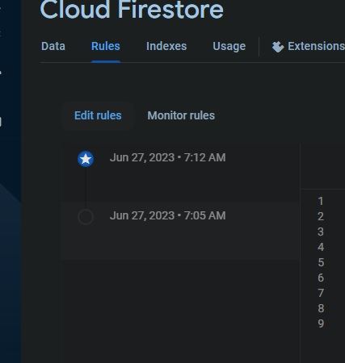

and the rules will be on the right:


Rules is a series of the match conditions


```
// Version of the firebase store
rules_version = '2';

// This will match the service running 
service cloud.firestore {
  match /databases/{database}/documents {
    // This allows anyone to read write from any document in the
    // database
    match /{document=**} {
      allow read, write: if true;
    }

    // If I wanted to prevent specific items from been written 
    // This allows the user with a specific User ID to 
    // to write etc to this collection
    match /[nameOfCollection]/{UserId}
    {
      allow read, get, create;
      allow write: if request.auth!= null && request.auth.uid == userId
    }

  }
}


```

This will match any database in the firestore and any of the documents

```

match /databases/{database}/documents 

```

and anything within should abide by the following matches:

```
// Allows anyone to perform the following actions
allow read, get, create;

```


```
// Allows anyone to perform the following actions
allow read, get, create;

```

you cannot target collections with match rules /collection only documents:

```

match /categories/{category}{
  allow read;
  // request is a global var for the request info which has the 
    // auth info on it showing which user is connecting must investigate!!
  allow write if request.auth != null && request.auth.uid === "[UserIDHardcoded]"
}

```

Is there a way to programmatically to update these rules?


To allow all the documents to be read: match /{document=**} (rulesthatapplytoall documents)

[Firebase Rules Documentaion(https://firebase.google.com/docs/firestore/security/get-started)]

[Great Web Firestore Sample practise project(https://firebaseopensource.com/projects/firebase/friendlyeats-web/)]

My Latest rule set:

```

rules_version = '2';

service cloud.firestore {
  match /databases/{database}/documents {
    match /{document=**} {
    allow read
      match /users/{userId}{
      	allow read, get, create;
        allow write: if request.auth != null && request.auth.uid == userId;
      }
      
      match /categories/{category}{
      	allow read;
      } 
    }
  }
}

```


[ZTM Career Paths(https://zerotomastery.io/career-paths/)]

use this to endorse others skills and get endorsements online.

[Discord Endorsement Server(https://discord.com/channels/423464391791476747/434851345392992277)]

##### React Interview Questions

[List of 200+ React JS Interview Questions(https://github.com/sudheerj/reactjs-interview-questions)]


###### PWAs

A Progressive Web App (PWA) is a web application that combines the best features of websites and mobile apps. PWAs are designed to work offline, provide a seamless user experience across different devices, and can be installed directly from the web browser. They offer fast loading times and can send push notifications.

If you would like to know the capabilities of a web app currently today check out: [What web can do today?(https://whatwebcando.today/)]

Use Lighthouse to measure website performance etc using the chrome dev tool: [Lighthouse (https://developer.chrome.com/docs/lighthouse/overview/)]


In order to use it just enable the extension and click on it and select generate report from the site you are currently reviewing.


Once completed it should provide you with a report as such:


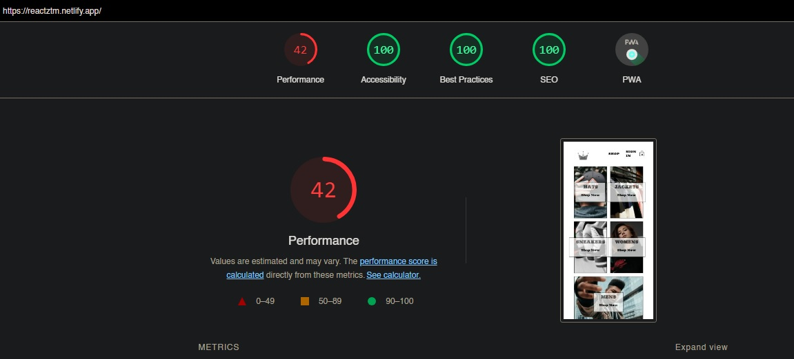


The three main pillars for the PWA that makes it a PWA is the following:


1. Https

2. App Manifest

3. Service Worker

1. HTTPS 

For more tips on what makes a good PWA Check out:  [PWA Checklist](https://web.dev/pwa-checklist/)


If you would like a free SSL certificate you can use [Lets Encrypt](https://letsencrypt.org/)

2. App Manifest: 

    An app manifest for Progressive Web Apps (PWAs) is a JSON file that provides essential metadata about the web application. It includes information like the app's name, icons, display mode, background color, and other settings, enabling installation and enhancing the user experience on various devices and platforms.

```

{
  "short_name": "React App",
  "name": "Create React App Sample",
  "icons": [
    {
      "src": "favicon.ico",
      "sizes": "64x64 32x32 24x24 16x16",
      "type": "image/x-icon"
    },
    {
      "src": "logo192.png",
      "type": "image/png",
      "sizes": "192x192"
    },
    {
      "src": "logo512.png",
      "type": "image/png",
      "sizes": "512x512"
    }
  ],
  "start_url": ".",
  "display": "standalone",
  "theme_color": "#000000",
  "background_color": "#ffffff"
}


```

[A Free Favicon generator](https://realfavicongenerator.net/)


3. Service Worker

This is a Diagram that represents the flow of a PWA with a service Worker


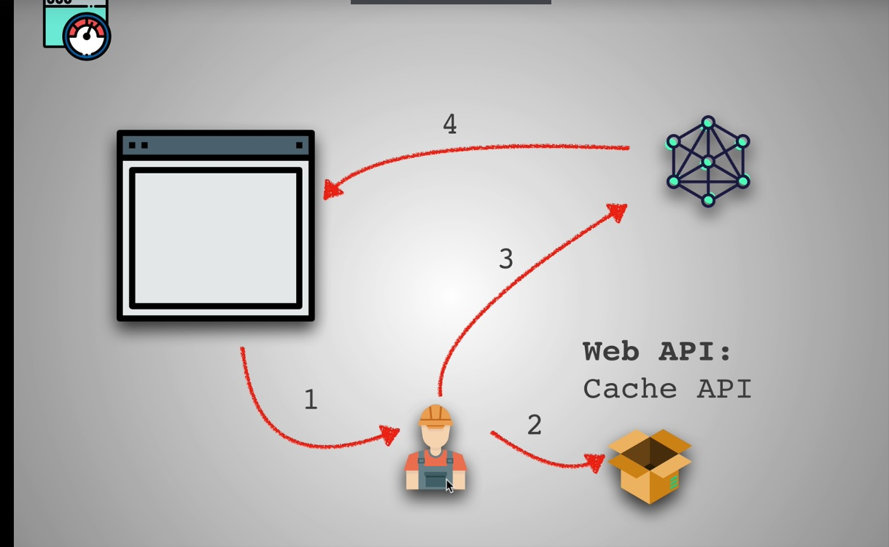


If you would like to implement a service worker in a react app you can follow this github Repo:


[Service Worker Integration](https://github.com/jeffposnick/create-react-pwa/compare/starting-point...pwa)


1. In a new and separate directory from our current project, generate a new CRA react app with the service worker template:

npx create-react-app my-app --template cra-template-pwa

2. Copy the service-worker.js and serviceWorkerRegistration.js file from the new created app and add it into our client/src directory.


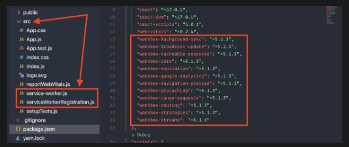


3. Copy the all the "workbox-*" dependencies from the package.json file in the dependencies section and add it into our client folders package.json dependencies. Then re-install your packages using yarn or npm depending on whichever package manager you have been using up to this point!


4. Update the index.js

```
import * as ServiceWorkerRegistration from './serviceWorkerRegistration'
ServiceWorkerRegistration.register();

```

5. npm run build

6. npm install -g serve

7. serve -s build

8. Run the url in a incognito browser to prevent caching and use lighthouse within the dev tools tabs to get the PWA report from lighthouse


# Testing

1. Unit Tests: 

Unit tests are tests that verify individual units of code to ensure they perform as intended in isolation.

2. Integration Tests: 

Integration tests verify the interactions and compatibility between different components or modules of a system, ensuring they work correctly together in a combined environment Mobile app connecting to API and then connecting to database.

3. Automation Tests:

 Automation tests are tests that are performed automatically using software tools or frameworks to execute pre-defined test scripts and verify the behavior, functionality, and performance of a system or software application Postman API collection tests etc

4. End to End Tests:

End-to-end tests are comprehensive tests that validate the entire workflow or user journey of a system, simulating real user interactions across multiple components, subsystems, or interfaces to ensure smooth integration and functionality


Test Driven Development and Behavior Driven Development

Items required to complete the testing.

1. Test Libraries Aka Scaffolding:

Jest 

Jasmine

Mocha 

Selenium

PlayWright


2. Assertion Library - A library to assert variables in the test


3. Test runner


4. Mock Spies and tests


End to End Test Libraries Rnd on what the current market is using and make a selection from there like playwright.

Three ways to to use as test runner:

DOM
Pupeeter
JSDOM

[Jest Automation Framework](https://jestjs.io/)


When working with jest and you running your tests with node and you dont want to specify the file each time.

You can add this to the package.json file to allow any file that has the test attribute to run 

"jest": "jest --watch *.js"


Jest has an assertion Library that you can use to expect different values etc.


[Jest Assertion Methods](https://jestjs.io/docs/using-matchers)

Here is a over simplified example:

```

it('Google Search is working', () => {
    expect(googleSearch('dogs',dbMock)).toExist;
})

it('does not return more than 3 matches ', () => {
    expect(googleSearch('com',dbMock).length).toEqual(3)
})

```

Example of using the describe method describing two test suites:

```

describe('googleSearch',() => {
    it('Google Search is working', () => {
        expect(googleSearch('dogs',dbMock)).toExist;
    })
    
    it('works with undefined and null input', () => {
        expect(googleSearch(undefined,dbMock)).toEqual([])
        expect(googleSearch(null,dbMock)).toEqual([])
    })
    
    it('does not return more than 3 matches ', () => {
        expect(googleSearch('com',dbMock).length).toEqual(3)
    })
    
})


describe('googleSearchNull',() => {
    
    
    it('works with undefined and null input', () => {
        expect(googleSearch(undefined,dbMock)).toEqual([])
        expect(googleSearch(null,dbMock)).toEqual([])
    })
    
    
    
})

```

##### FUN API'S 

1. [Star Wars(http://swapi.py4e.com/api/)]
2. [Chuck Norris(http://swapi.py4e.com/api/)]
3. [Numbers (http://numbersapi.com/#42)]
4. [Pokemon (https://pokeapi.co/)]


Making Async calls with jest example:

```
it('calls swapi to get people', () => {
    //expect.assertions(number) verifies that a
    // certain number of assertions are called during a
    // test. This is often useful when testing asynchronous
    //code, in order to make sure that assertions in a
    //callback actually got called.
    expect.assertions(1)
    // Just by adding the return keyword jest understands that this 
    // is a promise and wont pass the test until the promise is resolved
    // other way to achieve this is with the done keyword
    return swapi.getPeople(fetch).then(data => {
      expect(data.count).toEqual(87);
    })
  })

```

Example below by using the done keyword in Jest allows you to control when the test is complete as opposed to returning the promise like above:


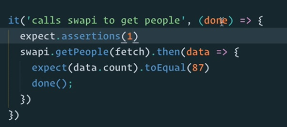

expect.assertions(2)

This checks that two assertions to complete for async functions this is very useful to make sure all async functions is complete.

[Jest Cheat Sheet](https://github.com/sapegin/jest-cheat-sheet)


Mocks,Spies,Stubs

Mocks in unit tests are simulated objects that mimic the behavior of real dependencies. They help isolate the code being tested, ensuring reliable and repeatable tests. By controlling the input and mocking the output, developers can verify the functionality of a specific unit without relying on the actual implementation of its dependencies.

```

it('getPeople returns count and results', () => {
  mockFetch = jest.fn().mockReturnValue(Promise.resolve({
    json: () => Promise.resolve({
        count: 87,
        results: [0,1,2,3,4,5]
    })
  }))

  expect.assertions(4)
  return swapi.getPeoplePromise(mockFetch).then(data => {
    expect(mockFetch.mock.calls.length).toBe(1);
    expect(mockFetch).toBeCalledWith('http://swapi.py4e.com/api/people');
    expect(data.count).toEqual(87);
    expect(data.results.length).toBeGreaterThan(5);
  })
  // done() 
})

```

The MockFetch method is simulating a async API call elimination the unit test from becoming an expensive call on the server and in the unit test enviroment.


##### Enzyme Testing Library

Enzyme is a JavaScript Testing utility for React that makes it easier to test your React Components' output. You can also manipulate, traverse, and in some ways simulate runtime given the output.

Enzyme's API is meant to be intuitive and flexible by mimicking jQuery's API for DOM manipulation and traversal.

[Enzyme's Github Repo(https://github.com/enzymejs/enzyme)]


NB NB !
IN THE NEXT VIDEOS YOU WILL HAVE TO USE REACT v18 

This is because currently Enzyme needs something called an ADAPTER to work with the latest version of React. 

Therefore, to avoid any issues, please clone my repo. This repo also includes the below change from what you will see in the next video

```

import { configure } from 'enzyme';
// import Adapter from 'enzyme-adapter-react-16'; only use for React 16
// import Adapter from '@wojtekmaj/enzyme-adapter-react-17'; only use for React 17
import Adapter from '@cfaester/enzyme-adapter-react-18';
 
 
configure({ adapter: new Adapter() });

```


1. Make sure the correct adapter is installed as dev dependancy based on your React Version


"@cfaester/enzyme-adapter-react-18": "^0.6.0"


2. Create SetupTests 

  ```
  import Enzyme from 'enzyme';
  import Adapter from 'enzyme-adapter-react-16';

  Enzyme.configure({ adapter: new Adapter() });
  
  ```

  When you run a shallow test run it does do a deep component test.

  ```
  // also remember to import react to use the Card Component import React from 'react'; and the card
  it('renders without crashing', () => {
  expect(shallow(<Card/>)).toMatchSnapshot();
  });
  
  ```

  The Test Above will do a shallow test on the component any components within this will not be tested
  ie reason for calling it shallow test:

  ```
  const Card = ({ name, email, id }) => {
  return (
    <div className='tc grow bg-light-green br3 pa3 ma2 dib bw2 shadow-5'>
      
      <div>
        <h2>{name}</h2>
        <p>{email}</p>
      </div>
    </div>
  );
}
  


  Now in the scenario where an component existed:

  
  

    const Card = ({ name, email, id }) => {
    return (
    <div className='tc grow bg-light-green br3 pa3 ma2 dib bw2 shadow-5'>
      
      <div>
        <h2>{name}</h2>
        <p>{email}</p>
      </div>
      </CustomComponent>
    </div>
    );
    }
  
  

The unit test would not test this </CustomComponent> as its a shallow test.


There is also the mount method from Enzyne however this is not always used and it can be used to mount components in the DOM or in JSDOM so it can become expensive very quickly.

In order to see more documentation on the three main methods of Enzyne

[Enzyne Main Methods(https://enzymejs.github.io/enzyme/docs/api/)]

HEADS UP! Depending on your version of Jest, in the next video, you may find that your snapshots aren't created properly (empty). This is a known issue with Jest and may require you to do the following: https://stackoverflow.com/questions/54419342/jest-enzyme-shallowwrapper-is-empty-when-creating-snapshot. I have included the code change mentioned in the article in this git repo to show you how to do this if you encounter the issue.

Enzyne Allows to render components in a test enviroment

```
import React from 'react';
import { shallow } from 'enzyme';
import Card from './Card';

it('renders without crashing', () => {
  expect(shallow(<Card/>)).toMatchSnapshot();
});

```

When this test runs above it take a snapshot of the component so if any changes are made to the component the test will fail.

If you make changes you would also need to run the test npm test and run the u command to update snapshot

If you wanna see the test coverage in a test suite you can run the following command:

```

npm test -- --coverage

```

In order to mock data for components that use the map method you need to mock some data for the map method to execute.

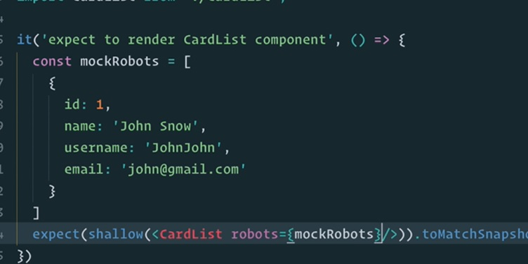


Testing Components that have state in them and with click events:

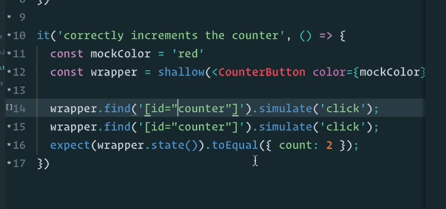

In order to access props:


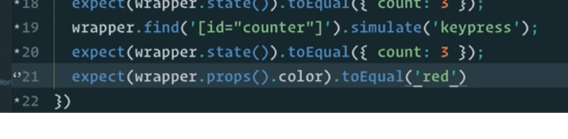

Always push your snapshots folder to the github to make sure that when the repo is cloned it has the snapshots on how the components should render


# JEST comes built in with Create React APP through react scripts

You might need to install separatly when using Vite build tool


When working with components that are chained to others like app component that requires a store you can install a redux-mock-store


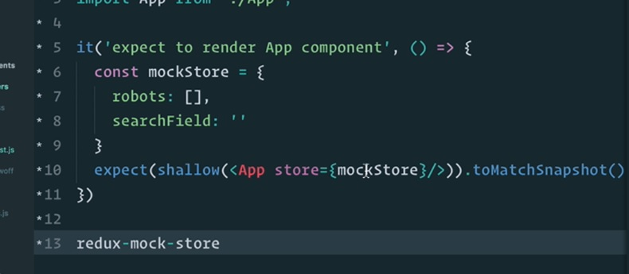


A way to make tests for complex components:

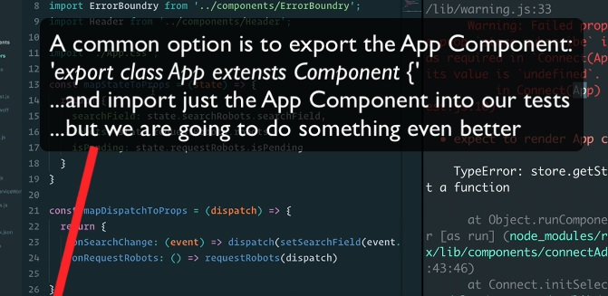


### Instead of trying test complex components I might need to simply the component which results in better code


you can run some tests before anything else:

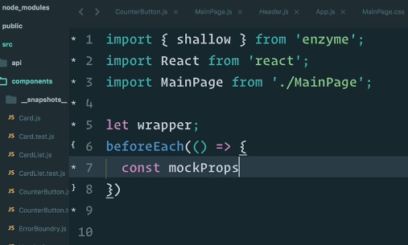

Access to the wrapper component instance and its functions:

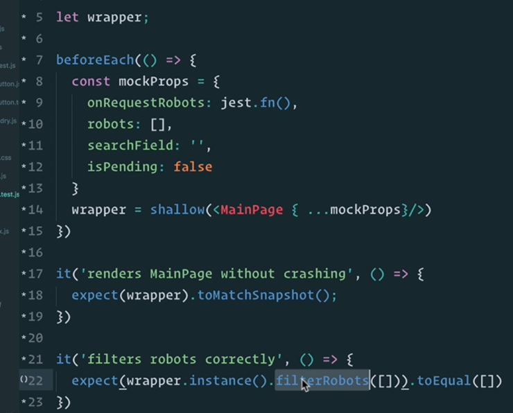


## React Testing Library

Main Libraries used in react testing library

 "@testing-library/jest-dom": "5.16.1",
 "@testing-library/react": "12.1.2",
 "@testing-library/user-event": "13.5.0",

 GetbyText takes a string regex:

 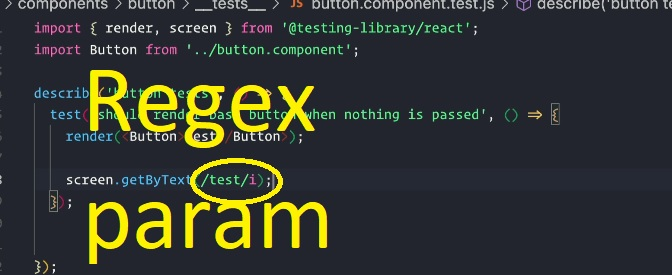

 Using the Wrapper for the mock redux store in utils.test.js

 [Here is more info on wrapper(https://testing-library.com/docs/react-testing-library/api/#wrapper)]

 screen.queryByText Returns nothing however screen.getbytext when nothing found it throws an error

 Need to rewrite the following into this crwn clothing app


 # TODO Mock Jest use Dispatch causing reference error

 ```
 
 test('It should dispatch signOutStart action when clicking on the Sign Out link', async () => {
        const mockDispatch = jest.fn();
        jest.spyOn(reactRedux, 'useDispatch').mockReturnValue(mockDispatch);
    
        renderWithProviders(<NavigationBar />, {
          preloadedState: {
            user: {
              currentUser: {},
            },
          },
        });
    
        expect(screen.getByText('SIGN OUT')).toBeInTheDocument();
    
        await fireEvent.click(screen.getByText('SIGN OUT'));
    
        expect(mockDispatch).toHaveBeenCalled();
        expect(mockDispatch).toHaveBeenCalledWith(signOutStart());
    
        mockDispatch.mockClear();
      });
 
 ```

 ## Project Directory Debug for tests and app debug setup

 

 and this is the launch.json setup to debug your tests:

 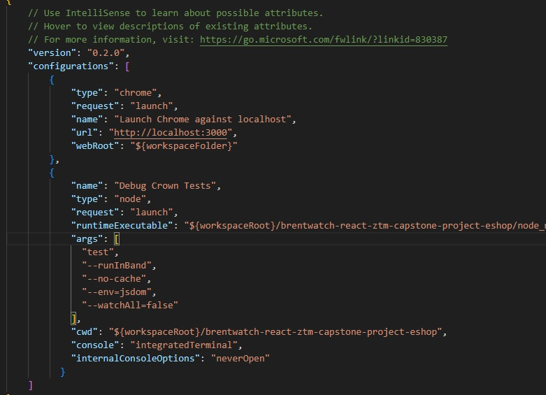

 ```
 
 // When checking if item is present use querybytext
 expect(screen.queryByText('SIGN IN')).toBeNull();
 
 ```


 # Gatsby Stuff

 https://github.com/ZhangMYihua/gatsby-blog-netlify/blob/master/src/pages/index.js

 https://github.com/ZhangMYihua/gatsby-blog-netlify/blob/master/gatsby-node.js

 then 322 lecture 08:00 update graph ql

 when using graphql in node js remember when making graphql calls in node js you must use this syntax becuase you dont get es6 features right out the box 

 ```
 // () for bare node js
 graphql(``)
 
 ```

 323 graphql 04:02

 324 graphql 02:00

 https://github.com/ZhangMYihua/gatsby-blog-netlify/blob/master/src/templates/blog-post.js


 # Open Source

 https://github.com/zero-to-mastery/start-here-guidelines

 https://github.com/zero-to-mastery

 Complete 

 https://www.udemy.com/course/complete-react-developer-zero-to-mastery/learn/lecture/16544016#notes


# WebPack + Babel

## What is Webpack?

Webpack is a powerful and widely-used open-source JavaScript module bundler that plays a crucial role in modern web development. Its primary function is to package and bundle various web assets, such as JavaScript, CSS, and images, making them ready for deployment on the web. By efficiently processing and optimizing these assets, Webpack helps improve a web application's performance and loading times.

One of Webpack's key features is its ability to create a dependency graph for the assets it processes. This graph allows Webpack to understand the relationships between different files, ensuring that they are bundled together in a way that minimizes duplication and maximizes efficiency. This also enables developers to employ a modular approach when building their applications, enhancing code organization and maintainability.

To achieve its bundling capabilities, Webpack utilizes loaders and plugins. Loaders are responsible for transforming specific types of files (e.g., transpiling modern JavaScript to older versions or converting SCSS to CSS) so that they can be included in the final bundle. Plugins, on the other hand, provide additional optimizations, such as minification, chunk splitting, or injecting environment variables.

Code splitting is another essential feature of Webpack. It allows developers to split their application's code into smaller chunks, which can be loaded on-demand when required. This helps reduce the initial loading time of the application and enhances the user experience, especially for large-scale projects.

In summary, Webpack simplifies the process of bundling web assets, optimizing their performance, and improving code organization for web developers. By leveraging its capabilities, developers can create faster, more efficient, and maintainable web applications.

## What is Babel?

Babel is a popular open-source JavaScript compiler used to transform modern ECMAScript (ES6+) code into backward-compatible versions that can run in older browsers and environments. As new JavaScript features are introduced, not all browsers support them immediately. Babel bridges this gap by converting the latest JavaScript syntax and features into older versions that are widely supported.

Developers can use Babel as part of their build process to ensure that their code is compatible with a broader range of browsers and environments, providing a more consistent experience for users. It also enables developers to take advantage of the latest language features and syntax while not worrying about compatibility issues.

Babel is highly configurable and extensible, allowing developers to customize the transformation process based on their project's specific needs. It has become an essential tool in modern web development, facilitating the adoption of new JavaScript language features without sacrificing compatibility with older browsers.


Create React App 

Hides alot of these boilerplate configuratios away from the developer.


Example:


1. Clone this repo: [Webpack Intro](https://github.com/ZhangMYihua/webpack-from-scratch)

2. Install webpack and webpack-cli

```

npm install webpack webpack-cli --save-dev

```

3. Add web pack config file to project: webpack.config.js

4. Update package.json 

```

"scripts": {
    "test": "echo \"Error: no test specified\" && exit 1",
    "build": "webpack --mode production",
    "start": "webpack-dev-server --open --mode development"
  },

```

5. Update webpack.config.js

  When working with this file we only have access to the ES5 syntax so to export use the follwing syntax:

  ```
  module.exports = { TODO 314 6 minutes in explains the rules loaders etc

  }
  
  ```

  Match the online repo [Online Webpack Config](https://github.com/ZhangMYihua/webpack-final/blob/master/webpack.config.js)


  6. Install babel libraries:


  ```
  
  npm install  @babel/core @babel/preset-env @babel/preset-react babel-loader --save-dev
  
  ```

  - @babel/preset-env - This library comes with transpiling javascript from ES6 down to ES5

  - @babel/preset-react There is other presets that can convert other frameworks and libraries like angular vue aurora and many others

  - babel-loader is for webpack

  7. Add the babel-rc file and rewrite from the online [Repo](https://github.com/ZhangMYihua/webpack-final/blob/master/.babelrc)

    This will convert our javascript to another version our browser will understand:


    ```
    {
      "presets": ["@babel/preset-env", "@babel/preset-react"]
    }
    
    ```

  8. Add the ability to transpile css with the loaders

  ```
    npm install style-loader css-loader
  
  ```

The use claus in the statement below the loaders evauluate right to left

  ```
   {
        test: /\.css$/,
        use: ['style-loader', 'css-loader']
  }
  

  ```

9. Add the HTML loader and the html-plugin

  ```
  
  npm install html-loader html-webpack-plugin

  ```

  Babel loader looks for index.html and index.js and loads the app from there as an Entry Point


Links:

[Webpack Concepts Documentation](https://webpack.js.org/concepts/)

[What is Regex?](https://www.regexbuddy.com/regex.html)

[Babel Usage](https://babeljs.io/docs/usage)

[Babel Loader](https://github.com/babel/babel-loader)

[Webpack StyleLoader](https://github.com/webpack-contrib/style-loader#style-loader)

[Webpack CSS Loader](https://github.com/webpack-contrib/css-loader#css-loader)

[Webpack HTML plugin](https://webpack.js.org/plugins/html-webpack-plugin/#installation)


# Key Developer Concepts

Some Basic Javascript concepts to learn before

## Javascript Array Methods:

1. map():

In JavaScript, the map() method is a higher-order array method that allows you to iterate over each element of an array and apply a function to transform or modify each element. It returns a new array containing the results of applying the provided function to each element of the original array.

The syntax for the map() method is as follows:

```

const newArray = array.map((currentValue, index, array) => {
  // Function to apply on each element
  // The return value will be added to the new array
});


```

2. filter() 

In JavaScript, the filter() method is another higher-order array method that allows you to iterate over an array and create a new array containing only the elements that pass a certain condition specified by a provided function. In other words, it filters out elements from the original array based on the given criteria.

The syntax for the filter() method is as follows:

```

const newArray = array.filter((currentValue, index, array) => {
  // Function that returns true or false based on a condition
  // If true, the element will be included in the new array
});


```

Parameters:

currentValue: The current element being processed in the array.

index (optional): The index of the current element being processed.

array (optional): The original array that filter() was called upon.


3. find()

In JavaScript, the find() method is another higher-order array method that is used to search for a single element in an array based on a provided condition. It returns the first element in the array that satisfies the condition specified by the given function.

The syntax for the find() method is as follows:

```

const foundElement = array.find((currentValue, index, array) => {
  // Function that defines the condition to search for an element
  // If true, the element will be returned and the iteration stops
});


```


4. includes()

In JavaScript, the includes() method is a built-in function for arrays and strings that checks if a specified element or substring is present in the array or string. It returns a Boolean value indicating whether the element or substring exists within the given array or string.

For arrays:

```

array.includes(searchElement[, fromIndex])

```

Parameters:

searchElement: The element to search for in the array.
fromIndex (optional): The index at which to start searching. If omitted, the search starts from the beginning of the array. If the fromIndex is negative, it is treated as array.length + fromIndex, meaning the search will start from the end of the array.

```

string.includes(searchString[, position])


```

For strings:

```

string.includes(searchString[, position])

```

Parameters:

searchString: The substring to search for in the string.
position (optional): The position (index) in the string where the search will start. If omitted, the search starts from the beginning of the string.
The includes() method returns true if the search element or substring is found and false if it is not found.


It works well on primitive types but for object types you cant do direct comparison

Here is example when it's points to differant locations in javascript memory bank:

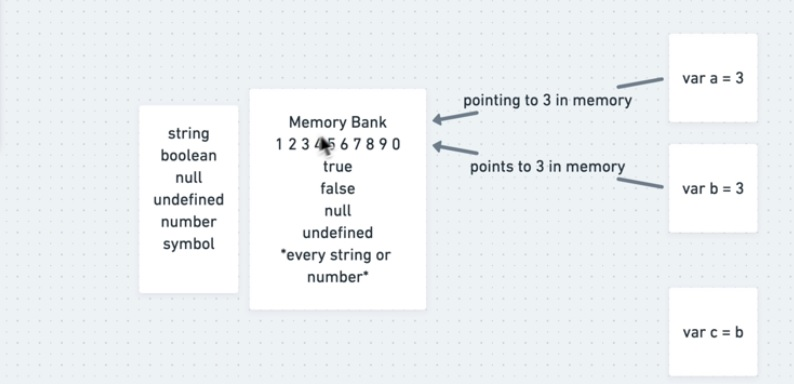

If its not a primitive its an object it will be placed in a reference.

Example of object pointers in javascript 

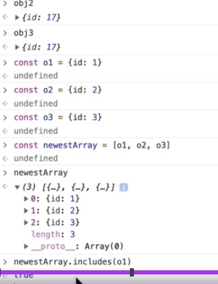

## Promises - Javascript Async Await

Introduced in ES6

ES7 Async Await

It was created to prevent callback hell:


Callback hell, also known as "pyramid of doom," is a situation that arises in asynchronous JavaScript code when multiple nested callbacks are used to handle asynchronous operations. This can lead to deeply nested and hard-to-read code, making it difficult to maintain and debug. Here's an example of callback hell:

```

asyncOperation1(function (result1) {
  // Handle result1
  asyncOperation2(function (result2) {
    // Handle result2
    asyncOperation3(function (result3) {
      // Handle result3
      asyncOperation4(function (result4) {
        // Handle result4
        asyncOperation5(function (result5) {
          // Handle result5
          // More nested callbacks...
        });
      });
    });
  });
});


```

Promises are a core feature in modern JavaScript for handling asynchronous operations. They represent a placeholder for a value that may not be available immediately. A Promise can be in one of three states: pending, fulfilled, or rejected. When an asynchronous operation completes, a Promise is resolved with the result or rejected with an error. Promises allow developers to write more structured and readable asynchronous code by chaining .then() for success and .catch() for error handling. Additionally, Promises can be combined using methods like Promise.all() and Promise.race(), enabling concurrent and efficient handling of multiple asynchronous tasks.


implementation Example:


```

function getRandomNumber() {
  return new Promise((resolve, reject) => {
    // Simulate a delay of 1 second
    setTimeout(() => {
      const randomNumber = Math.floor(Math.random() * 10) + 1;
      if (randomNumber <= 5) {
        resolve(randomNumber); // Resolve the Promise with the random number
      } else {
        reject("Error: Random number is greater than 5"); // Reject the Promise with an error
      }
    }, 1000);
  });
}


```


Consuming the Promise:

```

getRandomNumber()
  .then((number) => {
    console.log("Random number:", number);
  })
  .catch((error) => {
    console.error(error);
  });


```


# Async Await 

async/await is a modern feature introduced in ECMAScript 2017 (ES8) that simplifies working with asynchronous operations in JavaScript. It provides a more readable and sequential syntax for handling Promises.

async Function:

To use await, you need to define an async function. An async function always returns a Promise, and its return value is wrapped in a resolved Promise. Within an async function, you can use the await keyword to pause the execution until a Promise is resolved.

```

async function fetchData() {
  // Asynchronous operations using await
  const data = await fetch('https://api.example.com/data');
  return data.json();
}
await Keyword:
The await keyword can only be used inside an async function. It pauses the execution of the function until the Promise it awaits is resolved. If the Promise is rejected, it will throw an error that you can catch using a try/catch block.
javascript
Copy code
async function getData() {
  try {
    const result = await fetchData(); // Wait until fetchData Promise is resolved
    console.log(result);
  } catch (error) {
    console.error('Error:', error);
  }
}


```

Using async/await simplifies the syntax when dealing with asynchronous code, making it easier to read and maintain. It effectively avoids the "callback hell" problem and allows you to write asynchronous code in a more synchronous style, which can greatly enhance code clarity and organization. However, it's important to remember that async/await is not a replacement for Promises but rather a syntactic improvement over using traditional Promise chains or nested callbacks. Under the hood, async/await still relies on Promises to handle asynchronous operations.


# Caching Memoization


Caching and memoization are two techniques used in programming to optimize the performance of functions that are computationally expensive or frequently called with the same input values. They help reduce redundant calculations and speed up the execution of functions.

Caching:

Caching involves storing the results of expensive function calls and reusing those results when the same inputs occur again. The cache is typically implemented using data structures like objects, maps, or arrays. By caching the results, subsequent calls with the same inputs can be quickly retrieved from the cache instead of recomputing the function.


```
const cache = {};

function expensiveCalculation(input) {
  if (input in cache) {
    return cache[input];
  } else {
    const result = /* perform expensive calculation */;
    cache[input] = result;
    return result;
  }
}


```


Memoization:

Memoization is a specific form of caching where the results of function calls are stored in memory based on the function's input parameters. It is typically applied to functions that have deterministic behavior, meaning they produce the same output for the same input every time.
Memoization is often implemented using closures in JavaScript. It works by creating a higher-order function that takes the original function as an argument and returns a new function that caches the results of the original function.


```

function memoize(func) {
  const cache = {};
  return function (input) {
    if (input in cache) {
      return cache[input];
    } else {
      const result = func(input);
      cache[input] = result;
      return result;
    }
  };
}

const expensiveCalculationMemoized = memoize(function (input) {
  return /* perform expensive calculation */;
});


```


Memoization can significantly improve the performance of certain functions, especially when they are called with repetitive inputs. It helps avoid redundant computations and can be especially useful in recursive functions or dynamic programming algorithms.

Both caching and memoization are valuable techniques for optimizing code performance and should be used judiciously based on the specific use case and requirements of the function being optimized.


# Currying

Currying is a functional programming technique in which a function that takes multiple arguments is transformed into a series of functions, each taking a single argument. The curried function allows you to pass arguments one by one, and it returns a new function after each argument is passed until all the arguments are supplied, and the final result is produced.

In JavaScript, you can implement currying using closures or function returning techniques. Here's a simple example of a curried function:

```
function add(a) {
  return function (b) {
    return a + b;
  };
}

const add5 = add(5); // This returns a function that adds 5 to its argument

console.log(add5(3)); // Output: 8 (5 + 3)
console.log(add5(7)); // Output: 12 (5 + 7)

```

In this example, the add function takes the first argument a and returns a new function that takes the second argument b. The returned function has access to the a value due to the closure, enabling it to perform the addition.

Currying can make functions more flexible and reusable, allowing you to partially apply arguments and create specialized versions of the original function. It also plays a significant role in functional composition and function chaining, which are common practices in functional programming paradigms.


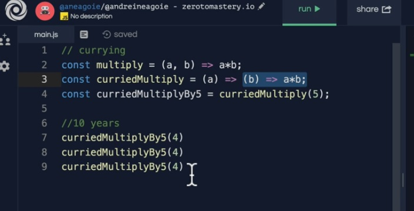

# ES6 Classes

ES6 (ECMAScript 2015) introduced the concept of classes in JavaScript, providing a more structured and object-oriented approach to defining constructor functions and creating objects. ES6 classes are syntactic sugar over JavaScript's existing prototype-based inheritance model.

Here's an example of defining and using a class in ES6:

```

class Person {
  constructor(name, age) {
    this.name = name;
    this.age = age;
  }

  sayHello() {
    console.log(`Hello, my name is ${this.name} and I am ${this.age} years old.`);
  }
}

// Creating objects from the class
const person1 = new Person("John", 30);
const person2 = new Person("Alice", 25);

person1.sayHello(); // Output: Hello, my name is John and I am 30 years old.
person2.sayHello(); // Output: Hello, my name is Alice and I am 25 years old.


```

Key features of ES6 classes:

constructor: The constructor method is called when a new object is created from the class and allows you to initialize object properties.

Methods: You can define methods directly within the class, and they are automatically added to the class prototype.

Inheritance: ES6 classes support inheritance using the extends keyword. You can create a subclass that inherits properties and methods from a parent class.

```

class Student extends Person {
  constructor(name, age, grade) {
    super(name, age); // Call the parent class constructor using super()
    this.grade = grade;
  }

  displayGrade() {
    console.log(`I am in grade ${this.grade}.`);
  }
}

const student1 = new Student("Bob", 15, 9);
student1.sayHello(); // Output: Hello, my name is Bob and I am 15 years old.
student1.displayGrade(); // Output: I am in grade 9.

```

ES6 classes provide a more intuitive syntax for working with objects and inheritance, making it easier to create and manage complex object-oriented code in JavaScript.

We can also use the instanceof in javascript to see if an object is of specific type.

This is all syntactic sugar it still transpiles to normal javascript like new keyword gets transpiled to the prototype 


hence the reason for prototypical inheritance

in order to inherit in javascript:

```

class dog extends Animal

```

In order to call anything on the parent you can use the `super` keyword


